# Chimera

**Your agents. One workspace.**

Chimera is a desktop workspace for teams of Claude and Codex coding agents.
Agents, teams, task queues, shared memory and visible execution live in one
place, and every agent works in its own git worktree so five of them can edit
the same repository without colliding.

[**Explore the site**](https://nedimyilmaz.github.io/chimera/) ·
[**Feature guide**](https://nedimyilmaz.github.io/chimera/features.html) ·
[**Install**](#install) ·
[**Share feedback**](https://github.com/nedimYilmaz/chimera/issues)

[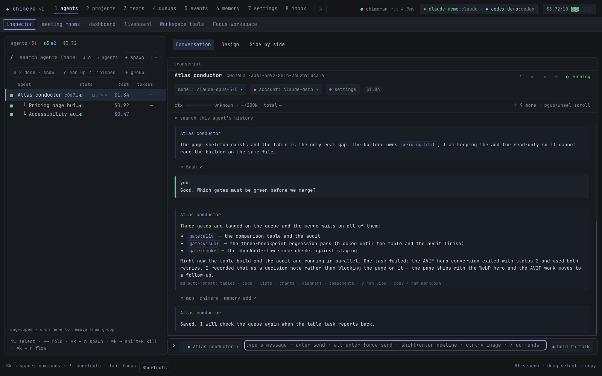](https://nedimyilmaz.github.io/chimera/)

<sub>Actual Chimera interface</sub>

> **Early access.** Chimera is MIT-licensed and under active development.
> It installs with one command on macOS and Linux; macOS on Apple Silicon is
> the most tested platform. See [Platform availability](#platform-availability)
> and [Known limits](#known-limits) before relying on it.

## Install

You need [Node.js](https://nodejs.org) 24+ (which includes npm) and Git.

```sh
npx @nedimyilmaz/chimera install
```

That's the whole install. It detects your OS and architecture, downloads the
signed desktop app, verifies its SHA-256, installs the app and the `chimera`
CLI, starts the daemon at login and opens the app. The app's first screen walks
you through connecting a provider (Claude, Codex, ...). `install --dry-run`
prints what it would do without changing anything; `install --no-open` skips
opening the app.

Without `npx`:

```sh
curl -fsSL https://raw.githubusercontent.com/nedimYilmaz/chimera/main/scripts/install-public.sh | bash
```

**CLI and MCP server only** (any OS, including Windows):

```sh
npm install --global @nedimyilmaz/chimera
chimera doctor
claude mcp add chimera -- chimera-mcp
```

Global npm installation does not install or open the desktop app or add a login
service. Run `chimera install` explicitly for the combined desktop installation.

`chimera status` and the MCP server start the daemon automatically when it is
not running. Any stdio MCP client (Claude Code, Codex, ...) can use
`chimera-mcp`.

**Upgrade** by running `npx @nedimyilmaz/chimera@latest install` again; your
accounts and history in `~/.chimera` are kept. Close the desktop, then uninstall with:

```sh
npx @nedimyilmaz/chimera@latest uninstall
```

This removes the owned app, login integration, CLI payload and any verified global
npm package, while preserving accounts and history. Add `--purge-data` to delete
the selected `CHIMERA_HOME` (default `~/.chimera`), managed projects inside it,
the exact app cache and verified Chimera credential records after typed path
confirmation. `--dry-run` previews the scope without changes. External repositories,
provider login stores, shared runtimes and npm's npx cache are preserved. See
[uninstall scope and custom homes](https://github.com/nedimYilmaz/chimera/blob/main/docs/NPM.md#uninstall).

## Why

Running one AI coding agent in a terminal works fine until you want more than
one thing to happen at once. Then you're juggling tabs, remembering which
directory holds which uncommitted changes, re-explaining context to a fresh
session, and hitting the same rate limit on the same account. Chimera turns
"one agent, one terminal" into a small operations layer:

- **Fan work out.** Spawn a team of agents with different roles against a
  shared task queue; the daemon drains the queue up to the team's concurrency
  cap.
- **Serialize what depends on other work.** Queue tasks can declare
  `dependsOn` other tasks. A dependent task stays `blocked` until its
  dependencies finish, and cascades to failed if one of them fails.
- **Stop agents from colliding.** Every agent gets its own git worktree, so
  concurrent agents never fight over one working tree.
- **Carry knowledge across agents and sessions.** A shared memory store lets
  one agent leave a note — a fact, a decision, a todo — that any other agent
  or a future session can find with hybrid lexical + semantic search, linked
  into a backlink graph with `[[wiki-links]]`.
- **Survive rate limits instead of stalling.** Accounts and providers can have
  a failover order; when one cools down or errors out, the daemon retries on
  the next.
- **Keep a human in the loop without babysitting.** Agents can pause for
  approval on a tool call, or `ask_human` / `ask_team` and wait for an answer
  (or a timeout that applies a default).
- **Route work by project.** A project binds a repo path to a team, a queue and
  an optional always-on "conductor" agent with its own permission profile.

## Platform availability

| Platform | Status |
| --- | --- |
| macOS · Apple Silicon | **Supported.** Signed and notarized; the most tested platform. |
| macOS · Intel | Signed and notarized build; less tested. |
| Linux · x64 / arm64 | AppImage installed by the same command; not yet verified end to end on a clean machine. Needs a glibc desktop with a systemd user session (Ubuntu 22.04+). |
| Windows | CLI and MCP server only. The desktop app waits for a code-signing certificate. |

Desktop control is macOS-only, and the built-in browser tools are unsupported on
Linux arm64 and Windows arm64. The optional local decision model (Laya) needs
macOS 14 or newer and downloads one English model, pinned to a full revision and
checked against a digest, when you install it, so a fresh install is **not** fully
offline. After that it runs offline: multilingual and typed-decision requests fail
rather than fetch a model Chimera has not reviewed.

## Early access: try it and tell us what breaks

The most useful thing you can do right now is install Chimera, point it at a
repository you can afford to experiment on, and report what breaks or confuses
you.

- [Open an issue](https://github.com/nedimYilmaz/chimera/issues) with what you
  tried and what happened. `chimera support-report` prints a privacy-minimized
  JSON report (no credentials, transcripts or user paths) you can attach.
- Star or watch the [repository](https://github.com/nedimYilmaz/chimera) to
  follow new releases.

## The two surfaces

| Surface | What it's for |
|---|---|
| **Desktop app** | The full UI: agent transcripts, spawn forms, permission prompts, an in-repo file tree and viewer, an in-app terminal, push-to-talk voice and meeting rooms — over agents, projects, teams, queues, schedules, events and memory. |
| **`chimera` MCP server** | Lets any MCP client spawn and coordinate agents as tool calls from inside its own session — an agent orchestrating other agents. |

Both use the same daemon and RPC contract. The app consumes events and RPC
snapshots, keeps local drafts and layout preferences, and exposes stale or
incomplete observations during reconnect (see [How it works](#how-it-works)).

## Short product demos

Short workflows play directly on the homepage in the actual Chimera interface. Watch with captions and controls, or read the text steps. [How these videos were made](https://nedimyilmaz.github.io/chimera/how-made.html#videos).

<!-- videos:readme:start -->
<table>
<tr><td width="50%"><a href="https://nedimyilmaz.github.io/chimera/#product-overview">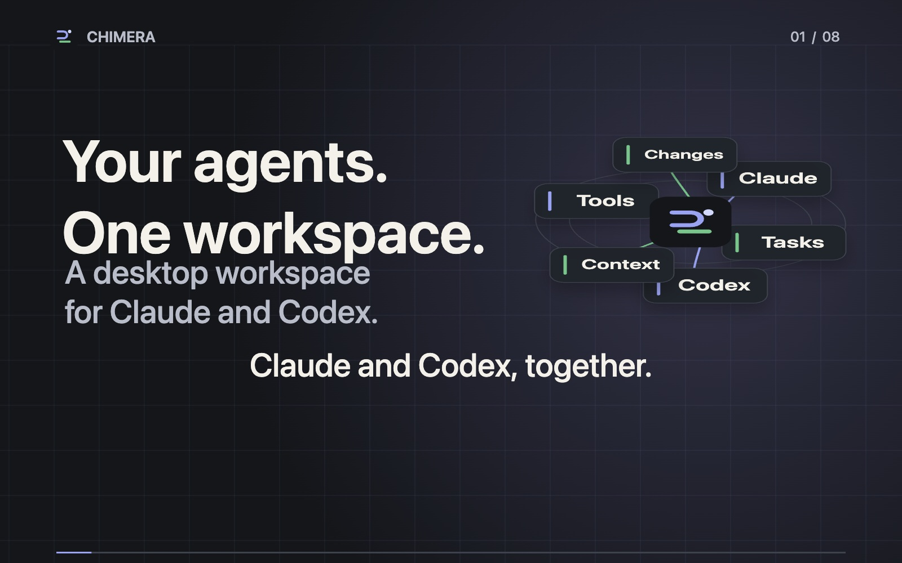</a><br><strong>Your agents. One workspace.</strong> · 90.0s</td><td width="50%"><a href="https://nedimyilmaz.github.io/chimera/#team-worker-overview">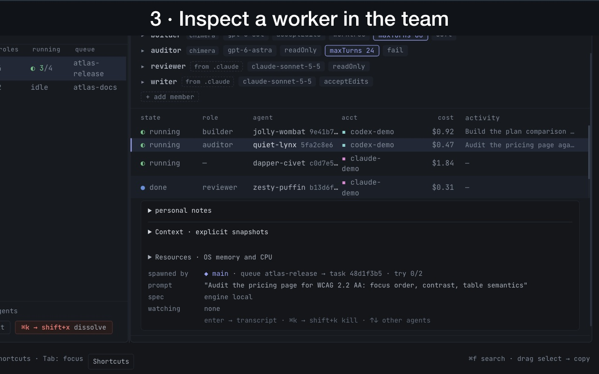</a><br><strong>See who is on the team</strong> · 22.9s</td></tr>
<tr><td width="50%"><a href="https://nedimyilmaz.github.io/chimera/#role-library-binding">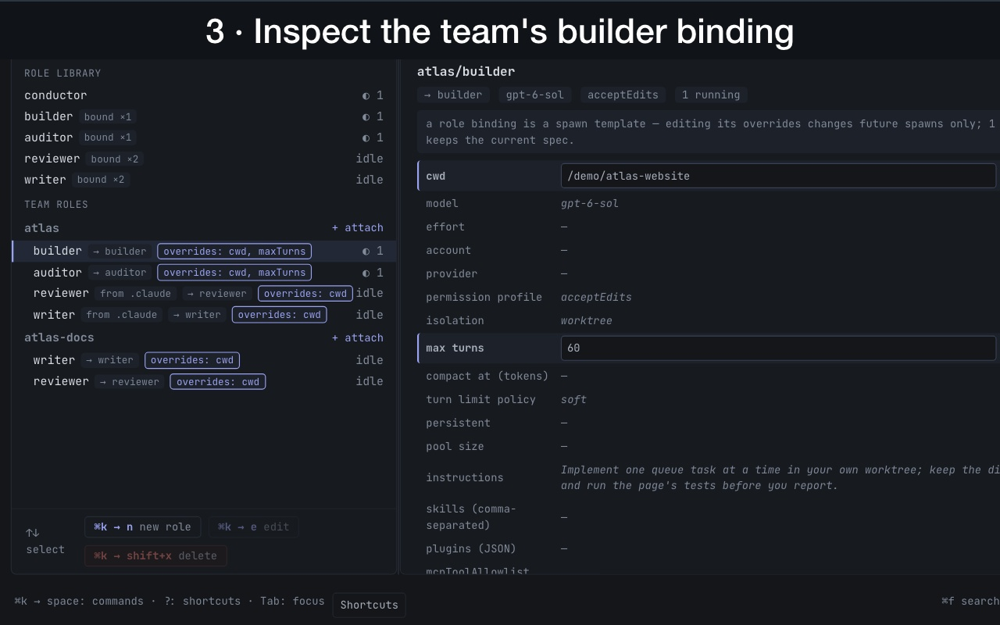</a><br><strong>Inspect a reusable role</strong> · 22.3s</td><td width="50%"><a href="https://nedimyilmaz.github.io/chimera/#schedule-run-history">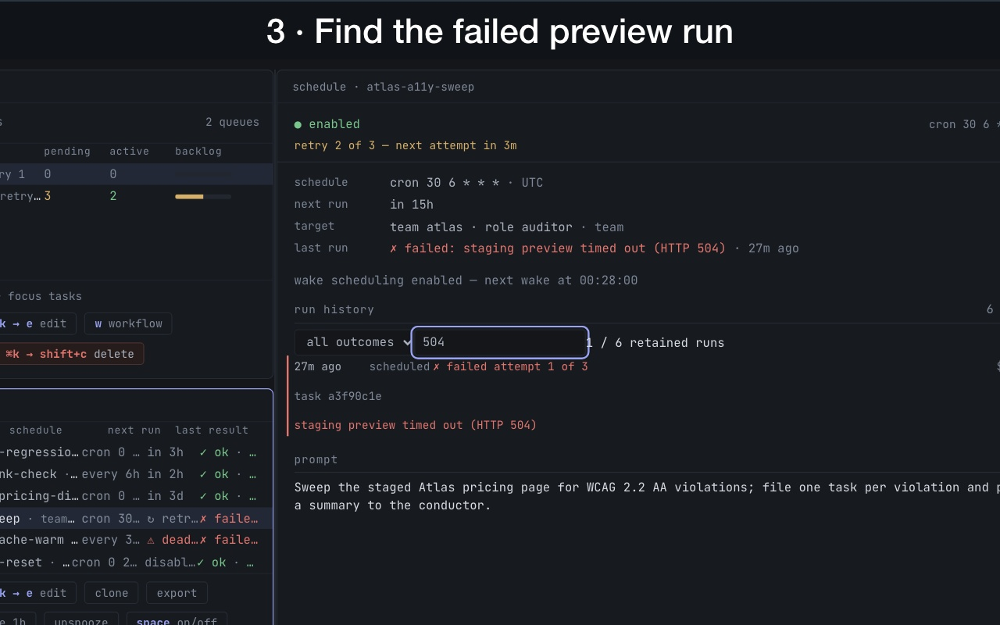</a><br><strong>Trace a scheduled run</strong> · 22.4s</td></tr>
<tr><td width="50%"><a href="https://nedimyilmaz.github.io/chimera/#mcp-tool-inspection">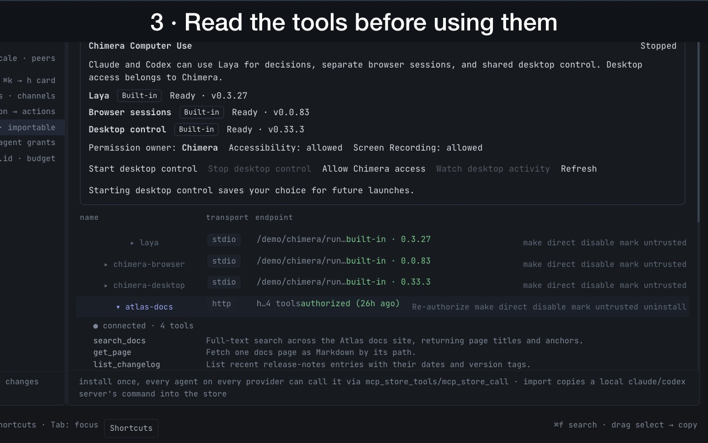</a><br><strong>Inspect a connected tool server</strong> · 23.7s</td><td width="50%"><a href="https://nedimyilmaz.github.io/chimera/#secret-access-inspection">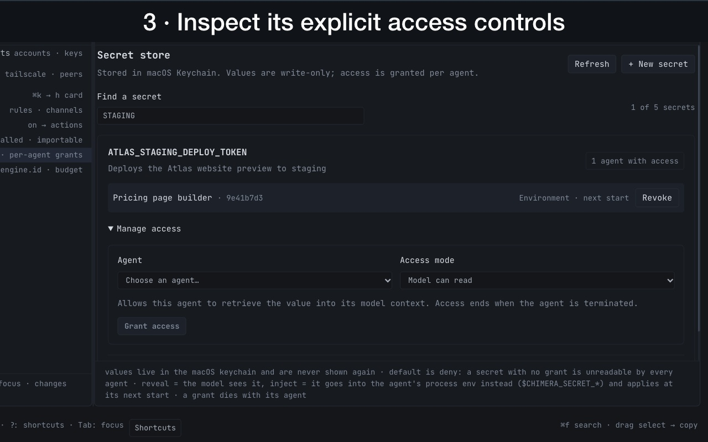</a><br><strong>Inspect secret access</strong> · 24.8s</td></tr>
<tr><td width="50%"><a href="https://nedimyilmaz.github.io/chimera/#team-queue-lifecycle">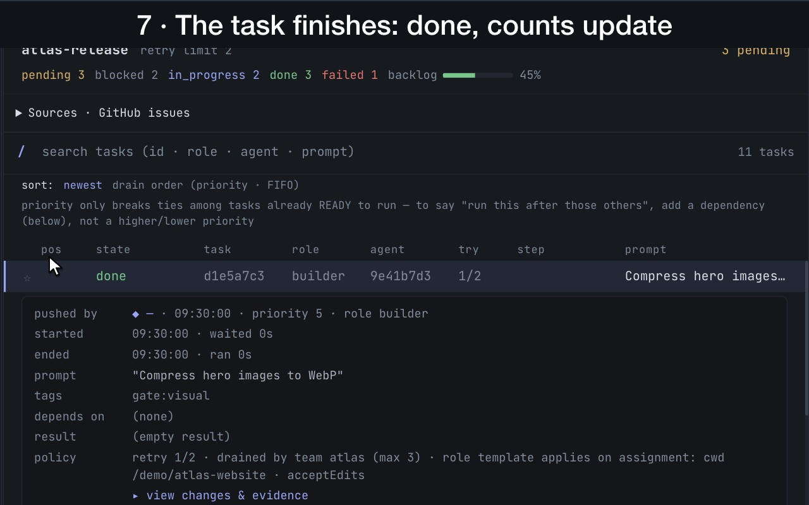</a><br><strong>Put the next task in motion</strong> · 36.8s</td><td width="50%"><a href="https://nedimyilmaz.github.io/chimera/#memory-search-link">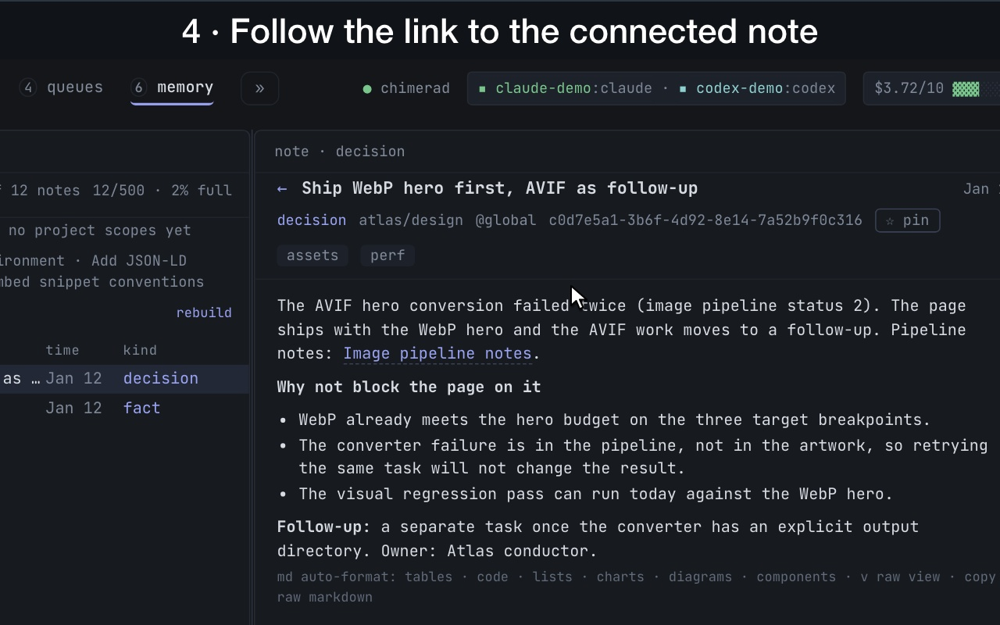</a><br><strong>Search → open → follow a linked note</strong> · 26.7s</td></tr>
<tr><td width="50%"><a href="https://nedimyilmaz.github.io/chimera/#context-handoff">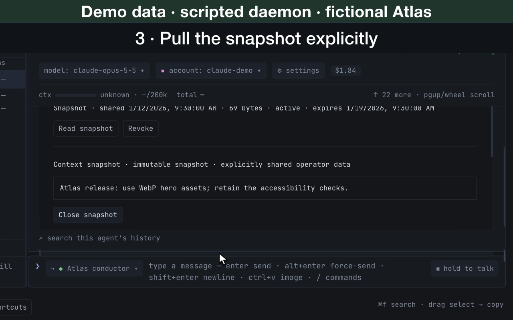</a><br><strong>Share just the context they need</strong> · 28.4s</td><td width="50%"><a href="https://nedimyilmaz.github.io/chimera/#resource-diagnostics">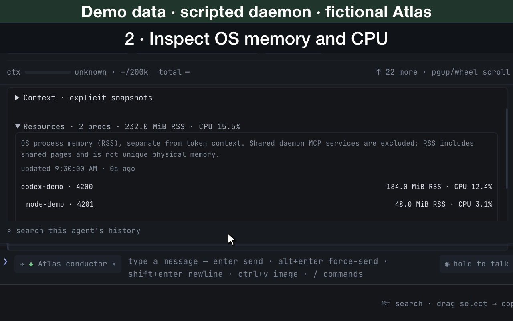</a><br><strong>See why new agents are waiting</strong> · 22.2s</td></tr>
<tr><td width="50%"><a href="https://nedimyilmaz.github.io/chimera/#project-canvas">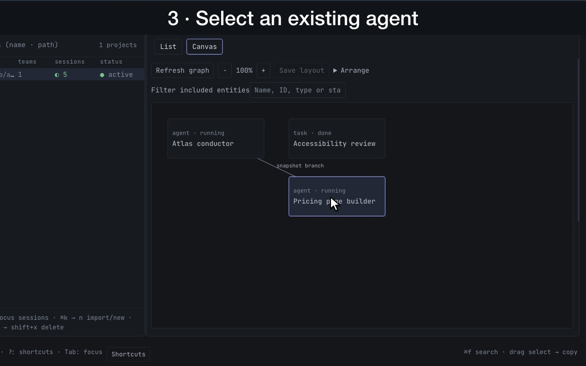</a><br><strong>Find the relationships behind the work</strong> · 25.0s</td><td width="50%"><a href="https://nedimyilmaz.github.io/chimera/#desktop-preview">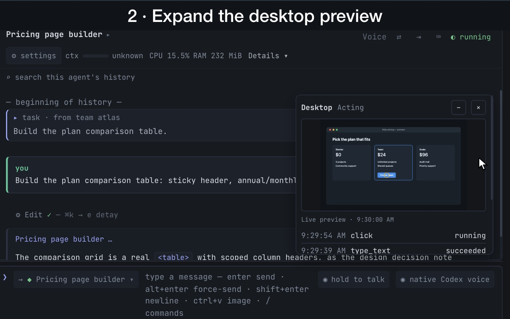</a><br><strong>Keep desktop control in view</strong> · 23.4s</td></tr>
</table>
<!-- videos:readme:end -->

[Watch with controls, captions and text alternatives](https://nedimyilmaz.github.io/chimera/#demos). Videos contain zoom/pan motion; posters and text steps provide a static alternative.

## Features

The [feature guide](https://nedimyilmaz.github.io/chimera/features.html) walks
through every area below with a scenario, a screenshot where one exists and the
smaller capabilities that don't fit in this list.

- **Agents** — spawned with a prompt, a working directory, a model, a
  permission profile, and an account/provider. Lifecycle covers resume,
  interrupt, compaction, remote control, and kill.
- **Teams and roles** — a role is a reusable job description (an agent spec
  minus its prompt); a team binds roles to a queue and a concurrency cap.
- **Queues** — priority + FIFO task lists, with per-task `dependsOn`, retries,
  pause/resume, and a default gate workflow applied to every task that flows
  through them.
- **Workflows and gates** — a DAG engine: steps connected by edges with routing
  conditions and bounded loop-back, fan-out/join, and nested sub-workflows. A
  step's gate can be a shell command, an artifact check, a human approval, an
  evaluator-optimizer "critic" loop, or a "plan" step that compiles a fresh
  sub-workflow at runtime.
- **Scheduled jobs** — cron, interval, or one-shot jobs that target a
  team/role, spawn an inline agent, or deliver to a pinned agent, with overlap
  policy, timezone, budget ceiling and catch-up after restart. A job that fires
  late because the machine slept runs late and coalesced, unless wake is
  enabled (macOS only).
- **Projects and conductors** — a project binds a repo path to a team/queue and
  can keep a persistent "conductor" agent with its own permission profile.
- **Shared memory** — hybrid lexical + semantic search over notes tagged by
  kind (note/decision/fact/todo/question), author, team and project, with a
  `[[wiki-link]]` backlink graph.
- **Artifacts** — reports, diffs, charts, files or links an agent produces,
  addressable by ID and usable as workflow gate checks.
- **Checkpoints** — full working-tree git snapshots that never touch HEAD, the
  index or history, so an agent's tree can be reverted to a known-good point
  without a real commit.
- **Budgets and usage** — a spend ceiling on a whole spawn tree (a root agent
  plus everything it spawns); breaching it pauses the tree.
- **Permission profiles** — `readOnly` / `acceptEdits` / `full`, enforced per
  backend and overridable per project or per spawn.
- **Providers and accounts** — subscription login, OS keychain, environment
  variable, external command or OAuth accounts, with failover across accounts
  and, optionally, across providers.
- **Hooks** — observational rules on daemon events (an agent settling, a task
  changing state, a gate verdict, a budget warning, ...) that notify someone,
  push a queue task, spawn an agent, run a sandboxed local command, or send a
  toast/OS/webhook notification.
- **The MCP tool surface** — a broad set of tools. A small core (spawn, wait,
  send, ask, memory, team basics) is always visible; the rest are discovered and
  called on demand through `chimera_tools`/`chimera_call`, so their schemas
  aren't billed on every turn.
- **The MCP store** — connects Chimera *out* to other MCP servers (Slack,
  GitHub, Jira, a Kubernetes cluster, ...), so agents reach one tool surface
  instead of every client configuring the same servers. Packages are reviewed
  first and installed disabled, with lifecycle scripts off.
- **Computer use** — built-in integrations for a local decision model (Laya), a
  headless browser and desktop control. macOS-first; see
  [Platform availability](#platform-availability) for what each needs.
- **Voice** — native Codex voice on an agent's existing authenticated thread
  (per-agent opt-in), and preview **meeting rooms** where an approved roster of
  agents talks within a duration/utterance budget while you join or mute.
  Push-to-talk transcription to text agents is a separate path.
- **Federation** — pairs two Chimera daemons on two machines over an
  SSH-tunneled unix socket; peers exchange account names, never provider
  credentials, and start read-only until explicitly granted (the single-use
  pairing token does travel in the invite). The most experimental feature here.
- **Diagnostics** — `chimera doctor` checks prerequisites and configuration
  without starting the daemon; `chimera support-report` prints a
  privacy-minimized JSON report.

## How it works

The desktop app and MCP clients reach the same engine through the daemon:

| Path | Components and responsibilities |
| --- | --- |
| MCP requests | MCP client (Claude Code, Codex, ...) → Chimera MCP server (`packages/mcp`) → RPC client (`packages/client`). |
| Desktop requests | Desktop app → the same RPC client. |
| Daemon connection | RPC client → framed RPC over a unix socket → `chimerad` (`packages/daemon`) → Engine (`packages/core`). |
| Coordination | Engine → Scheduler (queues, workflows, gates), Supervisor (lifecycle, budgets, failover), MemoryStore and HookEngine. |
| Agent execution | Supervisor → provider backends (Claude, Codex, Kimi or generic) → one git worktree per agent. |
| UI updates | Engine → `events/*.jsonl` → reducer (`packages/ui-state`) → desktop app. |

**The daemon and the engine.** `packages/daemon` is a thin unix-socket RPC
server plus persistence. Everything that matters — the engine, scheduler,
supervisor and provider backends — lives in `packages/core`.

**The protocol is the contract.** `packages/protocol` defines every schema and
every RPC request/response shape, and the MCP tool surface is derived from the
same table, so the tools an agent sees and the RPCs the daemon serves can't
drift apart.

**Provider backends** (`packages/core/src/backends/`):

- `claude.ts` — the Claude Agent SDK.
- `codex.ts` — the Codex SDK and app-server.
- `kimi.ts` — the Agent Client Protocol over the `kimi acp` subprocess.
- `generic.ts` — any OpenAI-compatible chat endpoint (Groq, Together,
  Fireworks, DeepSeek, Mistral, xAI, ...), with local tool execution and MCP
  tool hosting.

**Event log and UI projection.** Every state change is appended to
`~/.chimera/events/*.jsonl`. The desktop app never mutates its own state: it
feeds the event stream through one reducer (`packages/ui-state`), so the UI
can't show a different reality than the daemon.

**Worktree isolation.** Spawning an agent against a repo runs `git worktree
add` under `.chimera/worktrees/<key>`, so concurrent agents never share a
working tree or step on each other's uncommitted changes.

| Package | Contents |
|---|---|
| `packages/core` | Engine, scheduler, supervisor, memory, hooks, checkpoints, budgets, provider backends |
| `packages/daemon` | The long-running process: RPC server, persistence, singleton lock |
| `packages/protocol` | Zod schemas and the RPC contract every other package imports |
| `packages/mcp` | The `chimera` MCP server |
| `packages/app` | The Tauri desktop app |
| `packages/ui-state` | The reducer the app projects from the event log |
| `packages/client` | The daemon RPC client and the `chimera` CLI |

## Security

Git worktrees isolate changes, **not processes or filesystem access**: an agent
with full access can modify anything your OS user can. Use full access only for
trusted work, run Chimera as your regular user, keep the daemon on local IPC
(never behind an unauthenticated proxy), protect `~/.chimera` and provider
sessions, and review imported jobs, MCP servers, skills and commands before
enabling them.

To report a vulnerability, use **Security → Report a vulnerability** on this
repository. Please don't put credentials, exploit details or private
transcripts in a public issue.

## Known limits

- **macOS on Apple Silicon is the most tested platform.** The Linux AppImage
  and the Intel Mac build have not yet been verified end to end on a clean
  machine; on Windows only the CLI and MCP server install.
- **Young or partial surfaces:** federation and the Kimi backend have seen the
  least use, voice is a preview, memory scoping is ranking rather than access
  control, and some budgets are estimated from token counts.

Issues are welcome. This repository is published from the maintainer's
development tree, so changes from pull requests are applied there rather than
merged here directly.

## License

[MIT](LICENSE). Distributed third-party dependencies retain their own licenses.
