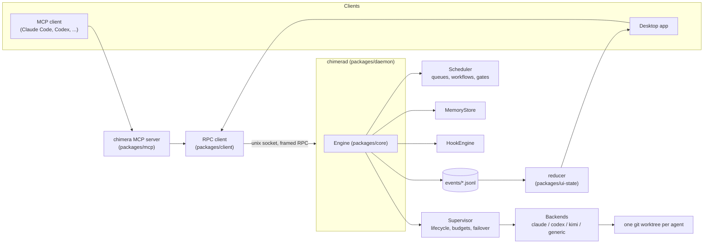

# Chimera

Chimera is a daemon that supervises many AI coding agents at once — across
providers, across accounts, in isolated git worktrees — behind one normalized
control surface. You talk to it through a desktop app or an MCP server; it
talks to Claude, Codex, Kimi, or any OpenAI-compatible model underneath.

If you've ever wanted to fan a task out to five agents instead of running
them one at a time, keep a long-lived team of agents working a queue while
you do something else, or stop losing context every time an agent's session
resets — that's the problem this exists to solve.

This is an early-stage project, not a finished product — see
[Status and limitations](#status-and-limitations) before assuming a capability
exists.

## Why

Running one AI coding agent in a terminal works fine until you want more than
one thing to happen at once. Then you're juggling terminal tabs, remembering
which directory has which uncommitted changes, manually re-explaining context
to a fresh session, and hitting the same rate limit on the same account
every time. Chimera turns "one agent, one terminal" into a small operations
layer:

- **Fan work out.** Spawn a team of agents with different roles against a
  shared task queue; the daemon drains the queue for you up to the team's
  concurrency cap.
- **Serialize what actually depends on other work.** Queue tasks can declare
  `dependsOn` other tasks — a dependent task sits `blocked` until its
  dependencies finish, and cascades to failed if one of them fails.
- **Stop agents from colliding.** Every spawned agent gets its own git
  worktree, so five agents editing the same repo never fight over the same
  working tree.
- **Carry knowledge across agents and sessions.** A shared memory store lets
  one agent leave a note — a fact, a decision, a todo — that any other agent
  (or a future session) can search for, hybrid-ranked (lexical + semantic) and
  linked into a backlink graph via `[[wiki-links]]`.
- **Survive rate limits instead of stalling on them.** Accounts and providers
  can be configured with a failover order; when one account cools down or a
  provider errors out, the daemon retries on the next one.
- **Keep a human in the loop without babysitting.** Agents can pause on a
  tool call for approval, or explicitly `ask_human`/`ask_team` a question,
  and block until someone answers or a timeout applies a default.
- **Route work by project.** Projects bind a repo path to a team, a queue,
  and an optional always-on "conductor" agent with its own permission
  profile, so "work on project X" has a consistent home.

## Install

### Desktop app + CLI (macOS and Linux)

The first public release (`v0.1.0`) is being prepared; these commands work
once it is published. You need Node.js 24+ (with npm) and Git.

```sh
npx @nedimyilmaz/chimera install
```

or, without npx:

```sh
curl -fsSL https://raw.githubusercontent.com/nedimYilmaz/chimera/main/scripts/install-public.sh | bash
```

The installer detects your OS and architecture (x64/arm64), verifies the
download's SHA-256, installs the desktop app and the `chimera` CLI, starts the
daemon at login and opens the app. `install --dry-run` prints what it would
do without changing anything; `install --no-open` skips opening the app.
`CHIMERA_VERSION=0.1.0` pins the version for the curl bootstrap.

| Platform | Desktop app | Daemon at login | Checked before install |
| --- | --- | --- | --- |
| macOS | `~/Applications/chimera.app` | launchd user agent | Bundle ID/version, signature, Gatekeeper, notarization |
| Linux | `~/.local/share/chimera/desktop/chimera.AppImage` + applications menu entry | systemd user unit | ELF architecture, AppImage runtime |

Linux runs the AppImage extracted, so FUSE is not required; it needs a glibc
desktop with a systemd user session (Ubuntu 22.04 or newer is the tested
baseline). **Windows is not supported yet** — the installer stops before
downloading anything.

A fresh `~/.chimera` starts with no accounts; the app's first screen walks you
through connecting a provider. To upgrade, run the `install` command of the
newer version. To uninstall, run `chimera stop`, close the app, then remove
the login item (macOS LaunchAgent, or `systemctl --user disable --now
chimerad.service` on Linux), the app and the `chimera` install directory.
Keep `~/.chimera` if you want your accounts and history.

### CLI and MCP server only

```sh
npm install --global @nedimyilmaz/chimera
chimera doctor
```

`chimera status` and the MCP server start the daemon automatically when it is
not running. To give an MCP client (Claude Code, Codex, or any stdio MCP
client) the Chimera tools:

```sh
claude mcp add chimera -- chimera-mcp
```

or, without a global install, point the client at
`npx --yes --package=@nedimyilmaz/chimera@<version> chimera-mcp`.

### From source

```sh
git clone https://github.com/nedimYilmaz/chimera.git && cd chimera
./scripts/install.sh
```

This needs Git, Node.js 24+, pnpm and, for the desktop app, Rust (pnpm and
Rust are installed if missing). It installs `chimerad`/`chimera` into
`~/.local/bin`, builds the desktop app and sets up the login service.
`--no-app` skips the desktop build, `--no-service` skips the login service,
and on macOS `--enable-wake` lets scheduled jobs wake a sleeping machine.

## The two surfaces

| Surface | What it's for |
|---|---|
| **Desktop app** | The full UI: agent transcripts, spawn forms, permission prompts, an in-repo file tree and viewer, an in-app terminal, push-to-talk voice and meeting rooms — over agents, projects, teams, queues, schedules, events and memory. |
| **`chimera` MCP server** | Lets any MCP client spawn and coordinate agents as tool calls from inside its own session — an agent orchestrating other agents. |

Both sit on the same daemon and the same RPC contract. Neither holds state
of its own: the app is a projection of the daemon's event log (see
[How it works](#how-it-works)).

## Features

- **Agents** — spawned with a prompt, a working directory, a model, a
  permission profile, and an account/provider. Lifecycle covers resume,
  interrupt, compaction, remote control, and kill.
- **Teams and roles** — a role is a reusable job description (an agent spec
  minus its prompt); a team binds roles to a queue and a concurrency cap.
- **Queues** — priority + FIFO task lists, with per-task `dependsOn`,
  retries, pause/resume, and a default gate workflow applied to every task
  that flows through them.
- **Workflows and gates** — a DAG engine: steps connected by edges with
  routing conditions and bounded loop-back, fan-out/join, and nested
  sub-workflows. A step's gate can be a shell command, an artifact check, a
  human approval, an evaluator-optimizer "critic" loop, or a "plan" step that
  compiles a fresh sub-workflow at runtime.
- **Scheduled jobs** — cron, interval, or one-shot jobs that target a
  team/role, spawn an inline agent, or deliver to a pinned agent, with overlap
  policy, timezone, budget ceiling and catch-up after restart. A job that
  fires late because the machine slept runs late and coalesced, unless wake
  is enabled (macOS only). The schedules panel previews the next five runs and
  supports clone/import/export, snooze and run-history filters.
- **Projects and conductors** — a project binds a repo path to a team/queue
  and can keep a persistent "conductor" agent with its own permission profile.
- **Shared memory** — hybrid lexical + semantic search over notes tagged by
  kind (note/decision/fact/todo/question), author, team and project, with a
  `[[wiki-link]]` backlink graph.
- **Artifacts** — reports, diffs, charts, files or links an agent produces,
  addressable by ID and usable as workflow gate checks.
- **Checkpoints** — full working-tree git snapshots that never touch HEAD,
  the index or history, so an agent's tree can be reverted to a known-good
  point without a real commit.
- **Budgets and usage** — a spend ceiling on a whole spawn tree (a root agent
  plus everything it spawns); breaching it pauses the tree.
- **Permission profiles** — `readOnly` / `acceptEdits` / `full`, enforced per
  backend and overridable per project or per spawn.
- **Providers and accounts** — subscription login, OS keychain, environment
  variable, external command or OAuth accounts, with failover across accounts
  and, optionally, across providers.
- **Hooks** — observational rules on daemon events (an agent settling, a task
  changing state, a gate verdict, a budget warning, ...) that notify someone,
  push a queue task, spawn an agent, run a sandboxed local command, or send a
  toast/OS/webhook notification.
- **The MCP tool surface** — about 180 tools. A small core (spawn, wait, send,
  ask, memory, team basics) is always visible; the rest are discovered and
  called on demand through `chimera_tools`/`chimera_call`, so their schemas
  aren't billed on every turn.
- **The MCP store** — connects Chimera *out* to other MCP servers (Slack,
  GitHub, Jira, a Kubernetes cluster, ...), so agents reach one tool surface
  instead of every client configuring the same servers. Settings → MCP store
  → **Install package** installs an exact npm version into Chimera's own
  package directory; packages are reviewed first and installed disabled, with
  lifecycle scripts off.
- **Voice** — native Codex voice on an agent's existing authenticated thread
  (per-agent opt-in), and preview **meeting rooms** where an approved roster of
  agents talks within a duration/utterance budget while you join or mute.
  Push-to-talk transcription to text agents is a separate path.
- **Federation** — pairs two Chimera daemons on two machines over an
  SSH-tunneled unix socket; credentials never cross the wire and peers start
  read-only until explicitly granted. The most experimental feature here.
- **Diagnostics** — `chimera doctor` checks prerequisites and configuration
  without starting the daemon; `chimera support-report` prints a
  privacy-minimized JSON report (no credentials, transcripts or user paths).

## How it works



**The daemon and the engine.** `packages/daemon` is a thin unix-socket RPC
server plus persistence. Everything that matters — the engine, scheduler,
supervisor and provider backends — lives in `packages/core`.

**The protocol is the contract.** `packages/protocol` defines every schema and
every RPC request/response shape, and the MCP tool surface is derived from the
same table, so the tools an agent sees and the RPCs the daemon serves can't
drift apart.

**Provider backends** (`packages/core/src/backends/`):

- `claude.ts` — the Claude Agent SDK.
- `codex.ts` — the Codex SDK and app-server.
- `kimi.ts` — the Agent Client Protocol over the `kimi acp` subprocess.
- `generic.ts` — any OpenAI-compatible chat endpoint (Groq, Together,
  Fireworks, DeepSeek, Mistral, xAI, ...), with local tool execution and MCP
  tool hosting.

**Event log and UI projection.** Every state change is appended to
`~/.chimera/events/*.jsonl`. The desktop app never mutates its own state: it
feeds the event stream through one reducer (`packages/ui-state`), so the UI
can't show a different reality than the daemon.

**Worktree isolation.** Spawning an agent against a repo runs `git worktree
add` under `.chimera/worktrees/<key>`, so concurrent agents never share a
working tree or step on each other's uncommitted changes.

| Package | Contents |
|---|---|
| `packages/core` | Engine, scheduler, supervisor, memory, hooks, checkpoints, budgets, provider backends |
| `packages/daemon` | The long-running process: RPC server, persistence, singleton lock |
| `packages/protocol` | Zod schemas and the RPC contract every other package imports |
| `packages/mcp` | The `chimera` MCP server |
| `packages/app` | The Tauri desktop app |
| `packages/ui-state` | The reducer the app projects from the event log |
| `packages/client` | The daemon RPC client and the `chimera` CLI |

## Security

Chimera runs AI-directed tools with the privileges you grant. Git worktrees
isolate changes, **not processes or filesystem access**: an agent with full
access can modify anything your OS user can. Only use full access for trusted
work.

- Keep the daemon on local IPC; never expose it through an unauthenticated proxy.
- Run as your regular user, never as Administrator/root.
- Protect `~/.chimera`, provider sessions and signing keys.
- Review imported jobs, MCP servers, skills and commands before enabling them.
- `autonomy: full` suppresses clarification questions independently of tool
  permissions.

To report a vulnerability, use **Security → Report a vulnerability** on this
repository. Please don't put credentials, exploit details or private
transcripts in a public issue.

## Status and limitations

- **Release installers are new.** The first signed macOS and Linux release is
  being prepared and still has to pass clean-machine install and upgrade
  checks; Windows waits for a code-signing certificate.
- **Federation is the least-hardened surface.** It works, but has seen the
  least real-world use.
- **The Kimi backend is young.** It talks ACP directly to the `kimi` CLI and
  has had far less mileage than the Claude and Codex backends.
- **No remote MCP transport.** A loopback-only HTTP MCP listener (off by
  default) exists so the `kimi` CLI can reach Chimera's tools; it binds
  `127.0.0.1`, refuses any request carrying an `Origin`, and its per-agent
  grants live only as long as the agent. Connecting from another machine is
  not built.
- **Memory scoping is a default, not a boundary.** An agent's searches default
  to its own project plus the global pool, but any caller can widen the scope
  and read any record by id. It is ranking, not access control.
- **Budgets don't cover every provider equally.** Providers that report a real
  billing figure are metered exactly; Codex, the OpenAI-compatible backends
  and models without a price-table row are estimated from token counts (shown
  with a `~`); Kimi reports no token counts and counts as $0. Releasing a
  budget-paused tree is an operator-only action that is audited and does not
  raise the budget.
- **Voice is a preview**, not a primary interaction mode.
- **Running several *subscription* logins against one provider may break its
  terms** and carries reported abuse-detection risk. API-key accounts are the
  sanctioned way to run multiple accounts.

Issues are welcome. This repository is published from the maintainer's
development tree, so changes from pull requests are applied there rather than
merged here directly.

## License

[MIT](LICENSE). Distributed third-party dependencies retain their own licenses.
